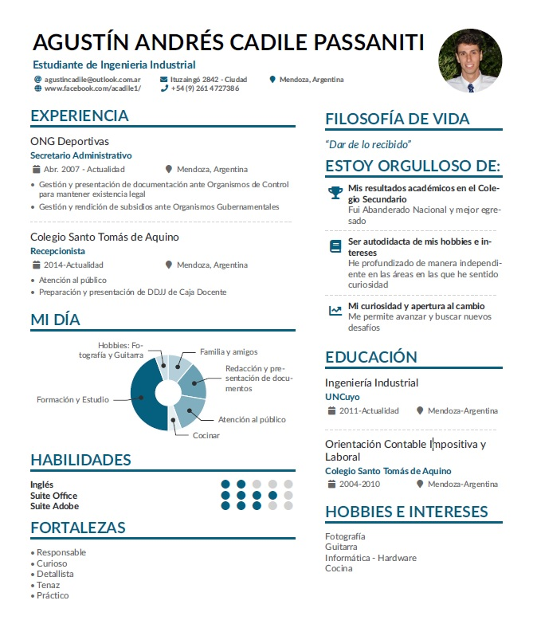

## Módulo 1 de Técnicas y Herramientas Modernas 2021 - UNCuyo

### Curriculum Vitae

Este primer trabajo tenía por finalidad familiarizarnos con los editores de texto Latex. La plataforma utilizada fue Overleaf, donde se modificó una plantilla otorgada por la cátedra.
(Para acceder a los archivos haga clic [aqui](https://github.com/AgustinCadile/AgustinCadile/tree/main/CV") o sobre la imagen)

### Traducción

