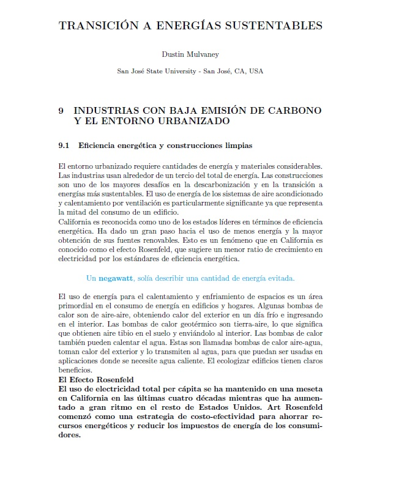
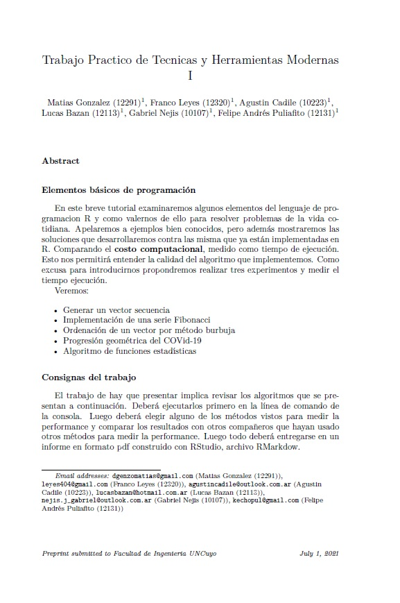
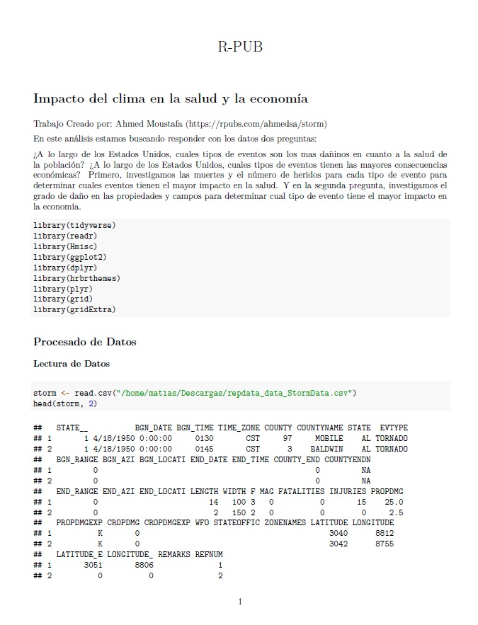
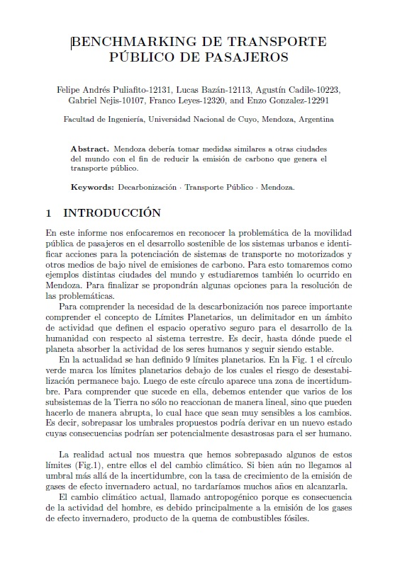

# Técnicas y Herramientas Modernas 2021 - UNCuyo
## Módulo 1 "Producción de textos e Hipertexto"
### Curriculum Vitae

Este primer trabajo tenía por finalidad familiarizarnos con los editores de texto Latex. La plataforma utilizada fue Overleaf, donde se modificó una plantilla otorgada por la cátedra.

(Para acceder a los archivos haga clic [aqui](https://github.com/AgustinCadile/AgustinCadile/tree/main/CV) o sobre la imagen)

### Traducción

El segundo trabajo del módulo consistió en realizar una interpretación en español de un capitulo del libro "Sustainable Energy Transition" de DUSTIN MULVANEY. A nuestro grupo le tocó el Capitulo 9 "Low Carbon Industries and the Built Environment".

(Para acceder a los archivos haga clic [aqui](https://github.com/AgustinCadile/AgustinCadile/tree/main/Traduccion) o sobre la imagen)

## Módulo 2 "Programación en Lenguaje R-Cran"

En este módulo se realizaron dos trabajos:

(Para acceder a los archivos haga clic [aqui](https://github.com/AgustinCadile/AgustinCadile/tree/main/Modulo_2) o sobre las imagenes)

* Trabajo de programación con ejercicios propuestos por la cátedra: se replicó una serie de ejercicios dados por los Profesores. Se presenta un archivo PDF y un R-Markdown con la resolución de los mismos.

* Trabajo de R-Pub: se buscó una publicación de la página R-Pub que contenga el archivo de datos .csv. Con él se replicó el trabajo publicado citando al autor. Se presenta un archivo PDF y un R-Markdown con la réplica del trabajo.

## Módulo 3 "Benchmarking"

El objetivo de este módulo fue realizar un benchmarking de un tema a elección. Nuestro grupo eligió el Transporte Público de Pasajeros como objeto de estudio.
Se analizaron varias ciudades con propuestas que creemos interesantes para los tiempos que corren y factibles de aplicar a nuestra provincia, Mendoza.

(Para acceder a los archivos haga clic [aqui](https://github.com/AgustinCadile/AgustinCadile/tree/main/Modulo_3) o sobre la imagen)

